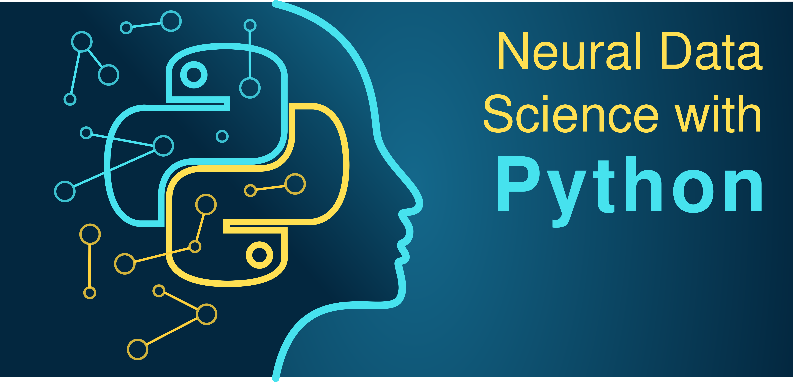
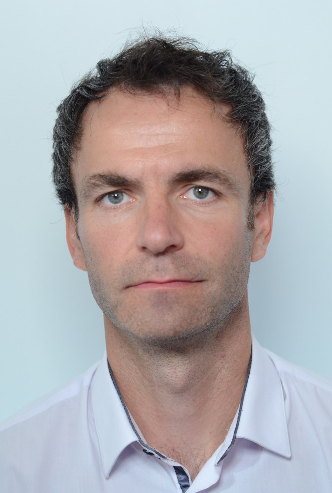

# 2021 Course : Neural Data Science with Python

This course provides a general introduction in the high-level, general-purpose porgramming lanuage [Python](https://www.python.org). 
It will furthermore cover basic analysis concepts used in the field of Neuroscience. 

### Objective of the Course 

The field of neuroscience is becoming more and more quantitative and this development is accompanied by of an ever-increasing stream of data derived from the brain. It is essential that this development
is performed by neuroscientists who are ready and able to process this data. Data science is an emerging field dedicated to understanding principles in data sets. This teaching unit aims to introduce the principles of data science applied to neural data.

Concretely, *Neural Data Science with Python* teaches how to handle, analyze, visualize neural data, to create models and to run simulations of neural systems using the Python programming language. The students will acquire to use different general and specific Python modules such as numpy, scipy, matplotlib, pandas, brian and the use of the Jupyter Notebook environment. The course will be supplemented with interactive courses on [DataCamp](https://www.datacamp.com/) aimed at helping students build programming skills at their own pace. 

### Prerequisites

Bases in neuroanatomy and physiology of the central nervous system are useful. No prior knowledge in programming is required as this course is for beginners.

### Competences Acquired

* Learning to program in Python.
* The basic principles of simple and advanced data analysis applied to neural data.
* The construction and implementation of single neuron and neural network simulations.

### What is Expected from You

* Curiosity and desire to learn.
* Active participation and contribution in particular during the tutorials.
* Feedback during the course and contributions to an open dialog to achieve on optimal learning experience.

### Lecture Organization and Material

Each course lasts for 2 hours. It consists of approximately 45 min lecture introducing the general motivation, scientific background and
analysis principles. The lecture is followed by an 1h 10 min long guided tutorial during which the programming/analysis is performed by the students based on a pre-prepared [Jupyter Notebook](https://jupyter.org). Students can follow the teachers tutorial progress in real-time on [Deepnote](https://deepnote.com/project/Neural-Data-Science-with-Python-Tutorial-DteRzlWZSbuTNmXj3nqDVA). Lecture and tutorial are separated by a short 5 min break. 

All lectures and guided tutorials take place at **9h-11h on Fridays's in room Durkheim, 2nd floor, access code: C2164, 45 rue des Saints-Pères** between **September 10th and November 26th, 2021**.

**Lecture Overview**

| # | Date | Title | Lecturer |  Material |
| ------------- | ------------- | ------------- | ------------- | ------------- | 
| 1 | Sep 10th | Introduction to Python : first steps | Michael Graupner | [Lecture L1](lectures/L1_Introduction_Python.pdf), [Tutorial T1](tutorials/T01_Python-first-steps.ipynb), [Deepnote](https://deepnote.com/project/Neural-Data-Science-with-Python-Tutorial-DteRzlWZSbuTNmXj3nqDVA), Homework : 2 chapters on DataCamp (see moodle)  |
| 2 | Sep 17th | Bioinformatics and Systems biology I  | Karine  Audouze | Lecture, Tutorial, Homework, Solutions (**[see Moodle](https://moodle.u-paris.fr/mod/folder/view.php?id=345101)**) |
| 3 | Sep 24th | Bioinformatics and Systems biology II    | Karine  Audouze | Lecture, Tutorial, Homework, Solutions (**[see Moodle](https://moodle.u-paris.fr/mod/folder/view.php?id=349398)**) |
| 4 | Oct 1st | Time series : basic operations | Michael Graupner | [Lecture L4](lectures/L4_Time_Series.pdf), [Tutorial T4](tutorials/T04_Time-series.ipynb), [Homework E4](exercises/E04_Time-series.ipynb), [Solutions E4](exercises/E04Solutions_Time-series.ipynb), [Deepnote](https://deepnote.com/project/Neural-Data-Science-with-Python-Tutorial-DteRzlWZSbuTNmXj3nqDVA)  |
| 5 | Oct 8th | Wrangling spike trains : basic analysis, raster plot, PSTH, Poisson spike trains |  Michael Graupner | [Lecture L5](lectures/L5_Spike-trains.pdf), [Tutorial T5](tutorials/T05_Spike-trains.ipynb), [Homework E5](exercises/E05_Spike-trains.ipynb), [Solutions E6](exercises/E05Solutions_Spike-trains.ipynb), [Deepnote](https://deepnote.com/project/Neural-Data-Science-with-Python-Tutorial-DteRzlWZSbuTNmXj3nqDVA)  | 
| 6 | Oct 15th | Spectral analysis of analog signals : Fourier transform, Spectrogram, Signal Filtering | Michael Graupner | [Lecture L6](lectures/L6_Analog-signals.pdf), [Tutorial T6](tutorials/T06_Analog-signals.ipynb), [Homework E6](exercises/E06_Analog-signals.ipynb), [Solutions E6](exercises/E06Solutions_Analog-signals.ipynb), [Deepnote](https://deepnote.com/project/Neural-Data-Science-with-Python-Tutorial-DteRzlWZSbuTNmXj3nqDVA) |
| 7 | Oct 22nd | Biophysical modelling of single neurons : integrate-and-fire neuron, introduction to numerical integration | Jonas Ranft | [Lecture L7](lectures/L7_Biophysical-Neuron-Models21.pdf), [Tutorial T7](tutorials/T07_Biophysical-Neuron-Models21.ipynb), [Homework E7](exercises/E07_LIF.ipynb), [Solutions S7](exercises/E07Solutions_LIF.ipynb), [Deepnote](https://deepnote.com/project/TD-7-Leaky-Integrate-and-Fire-odC1isiZSDGLNKaNv2Q_kg/%2FTD7_Biophysical-Neuron-Models.ipynb) |
| 8 | Oct 29th | Spiking neural network simulations with Brian  | Marcel Stimberg | [Lecture L8](lectures/L8_Spiking-Neural_Networks.pdf), [Tutorial T8](tutorials/T08-Spiking-Neural-Networks.ipynb), [Homework E8](exercises/E08-Spiking-Neural-Networks.ipynb), [Solutions S8](exercises/E08-Spiking-Neural-Networks-solution.ipynb), [Deepnote](https://deepnote.com/project/T08-Spiking-Neural-Networks-DataSciPy-2021-ZSpqb_OQSW2F18OA_DbuFw/%2FT08-Spiking-Neural-Networks-Empty.ipynb) |
| 9 | Nov 5th | Regression analysis : correlation analysis, logisitic regression, nonlinear regression  | Michael Graupner | [Lecture L9](lectures/L9_Regression-analysis.pdf), [Tutorial T9](tutorials/T09_Regression-analysis.ipynb), [Homework E9](exercises/E09_Regression-analysis.ipynb), [Solutions S9](exercises/E09Solutions_Regression-analysis.ipynb), [Deepnote](https://deepnote.com/project/Neural-Data-Science-with-Python-Tutorial-DteRzlWZSbuTNmXj3nqDVA/%2FT09_Regression-analysis-Empty.ipynb)  |
| 10 | Nov 12th | Dimensionality reduction : PCA, covariance matrix, factor extraction | Michael Graupner | [Lecture L10](lectures/L10_Dimensionality-reduction.pdf), [Tutorial T10](tutorials/T10_Dimensionality-reduction.ipynb), [Homework E10](exercises/E10_Dimensionality-reduction.ipynb), [Solutions S10](exercises/E10Solutions_Dimensionality-reduction.ipynb), [Deepnote](https://deepnote.com/project/Neural-Data-Science-with-Python-Tutorial-DteRzlWZSbuTNmXj3nqDVA/%2FT10_Dimensionality-reduction-Empty.ipynb) |
| 11 | Nov 19th | End-of-Course projects presentation; Open Tutorial | Michael Graupner | [Lecture L11](lectures/End-of-Course-Projects.pdf), [Tutorial T11 jupyter-notebook](tutorials/T11_Project-LFP_from_raw_ephys_trace.ipynb), [Tutorial T11 support files](https://filesender.renater.fr/?s=download&token=066c0f3a-5e59-4d15-90bb-92deed7ad413),  [Deepnote](https://deepnote.com/project/Neural-Data-Science-with-Python-Tutorial-DteRzlWZSbuTNmXj3nqDVA/%2FT11_Project-LFP_from_raw_ephys_trace.ipynb) |
| 12 | Nov 26th | Classification and clustering : SVM, KMeans estimate  | Michael Graupner | [Lecture L12](lectures/L12_Classification-Clustering.pdf), [Tutorial T12](tutorials/T12_Classification-Clustering.ipynb), [Deepnote](https://deepnote.com/project/Neural-Data-Science-with-Python-Tutorial-DteRzlWZSbuTNmXj3nqDVA/%2FT12_Classification-Clustering-Empty.ipynb) |

### Course Evaluation

**Continuous control (50 % of the final mark) :** The students receive small **homework assignments** which are an extension of the 
in-course tutorial. The subject is related to the last course. The homeworks assignments with the respective Notebook file are posted in the **moodle** of the course. The results have **to be submitted through the
moodle by Friday 9am** before the next course (e.g., the assignments of the course on Friday Sep 10th have to be submitted by Friday Sep 17th
9am). Practically, use the provided Jupyter Notebook (see table above or the moodle), add your edits to this file, and submit the modified Jupyter Notebook through the moodle.

Some homework assignments will consist in completing interactive, online assignments on [DataCamp](https://www.datacamp.com/).

**Final exam (50 % of the final mark) :** Students will receive a list of projects they will work on for an extended period of time (about 1.5 months). Projects are small programming projects aimed at independently applying analysis methods acquired during the course. The project can be worked on individually or in teams of two students. More information on the End-of-Course projects and a concrete list of available projects are available [here](EndOfYearProjects.md). 

All student work - the weekly homework assignments and the End-of-Course project report - can prepared in English or French, up to the choice of the student. 

### Accessible Computer Rooms and Account

There are three computer rooms available outside the hours of the course. The machines in these rooms feature the same Python installation as in the course and the same home directories (files stored during the course can be accessed 
from these machine) : 
*  Room **Durkheim** : left staircase from the main entrance hall to access lecture halls Delmas or balcon Binet, second floor (access code C2164). There are courses in that room during which it is not accessible.
*  Room **T209 bis** : 2nd floor, in front of Avogadro D, free access 
*  Room **T117** : 1st floor, free access 

You connect to your account on those machines - as well as on the classroom machines - with your university UID as login.  The password is your full student number. It it highly recommended to change the default password, 
which can be done with the command `passwd` in a command line terminal. Please contact [Isabelle Moisenier](mailto:isabelle.moisenier@parisdescartes.fr) 
or [Luc Tamisier](mailto:Luc.Tamisier@parisdescartes.fr) in case of problems with the machines or your account. 

### Identification

M1 S1 Neuro

Code UE : NS0AM020

Acronym : DataSciPython

ECTS : 3

Time volume : 24 hours

### Language of the Course 

The dominant teaching language of the course with be English, while the lecturers provided by Karine Audouze will be in French with slides and material in English. 

### Course Organizers and Teachers  

The course is organized by [Michael Graupner](mailto:michael.graupner@parisdescartes.fr). Lectures will furthermore be taught by [Jonas Ranfts](mailto:jonas.ranft@ens.fr),  [Karine Audouze](mailto:audouze.p7@gmail.com), and  [Marcel Stimberg](mailto:marcel.stimberg@inserm.fr). All questions regarding access to your university account can be addressed to  [Luc Tamisier](mailto:luc.tamisier@parisdescartes.fr) or [Isabelle Moisenier](mailto:isabelle.moisenier@parisdescartes.fr).

Please direct all basic inquiries to [Michael Graupner](mailto:michael.graupner@parisdescartes.fr) by email or pass by his office : 

> Saints-Pères Paris Institute for the Neurosciences  
> CNRS UMR 8003, Université de Paris  
> bureau : H 358  
> 45 rue des Saints Pères  
> 75270 Paris Cedex 06  
> France

**Overview of all Lecturers**

| Picture | Name | Email | Address | 
| ------------- | ------------- | ------------- | ------------- | 
|  | Jonas Ranft | [jonas.ranft@ens.fr](mailto:jonas.ranft@ens.fr) | Ecole Normale Supérieure, Institute de Biologie, 46 rue d'Ulm, 75005 Paris  |
|  | Karine Audouze | [audouze.p7@gmail.com](mailto:audouze.p7@gmail.com) | Université de Paris, Systems Toxicology Group, 45 rue des Saints-Pères, 75006 Paris  |
|  | Marcel Stimberg | [marcel.stimberg@inserm.fr](mailto:marcel.stimberg@inserm.fr)  | Institut de la Vision, Computational Neuroscience of Sensory Systems, 17 rue Moreau, 75012 Paris |
|  | Michael Graupner | [michael.graupner@parisdescartes.fr](mailto:michael.graupner@parisdescartes.fr) | Université de Paris, SPPIN, 45 rue des Saints-Pères, 75006 Paris |

### Python Requirements

All course material will run smoothly on the classroom machines, which will have all the required modules installed. 

In case you want to run the course material on your private computer, the following packages are required : 
* Python 3.7 (or the current common versions 3.6, 3.8)
* numpy
* scipy
* jupyter
* matplotlib 
* pandas
* xlrd 
* biopython
* scikit-learn
* [Brian2](http://briansimulator.org/)

We will set up a Python programming party in the beginning of the academic year for all students who are interested in installing the Python environment required for the class on their laptops. 

Find [here](lectures/PythonInstallation.pdf) the slides with details of the Python installation. 

### External Resources

This class is supported by , an intuitive learning platform for data science and analytics. For education, Datacamp provides courses for free. We have arranged for you to have access to these courses while you are enrolled in the ***Neuroscience Master*** of the Université de Paris.

This class is also supported by , a new kind of data science notebook : Jupyter-compatible with real-time coding and running in the cloud. The ***Neural Data Science with Python*** class profits from the free education plan of Deepnote. 

### Licence 

See the [LICENSE](LICENSE) file for license rights and limitations (Attribution 4.0 International). 